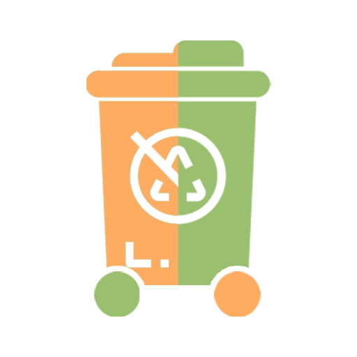
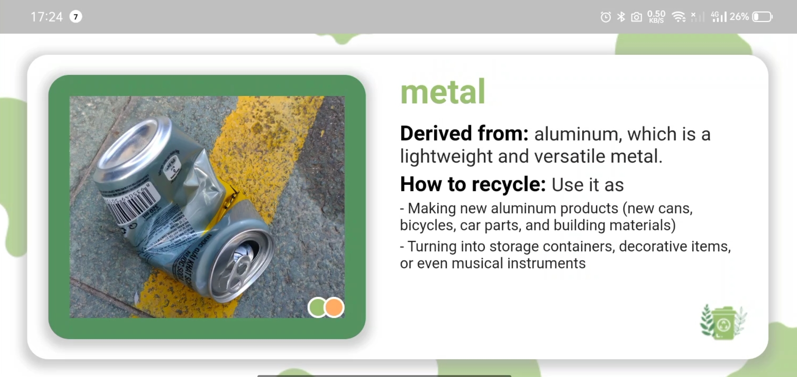
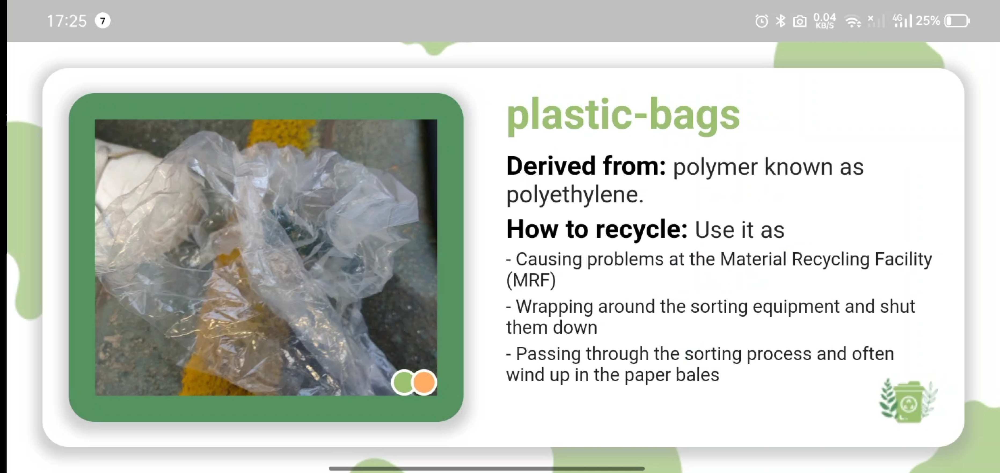

# eGreenBin Waste Classification

This is a simple Flutter project that classifies trash items as either recycled or non-recycled, and provides basic information about each item.

## Getting Started

To get started with this project, follow these steps:

1. Clone the repository
2. Open the project in your preferred IDE (e.g. Android Studio, VS Code)
3. Run `flutter pub get` to install the required dependencies
4. Run the project in an emulator or on a physical device

## Using The App

The app has a simple user interface that allows you to use.
- First, when you open the app you will need to connect with Iot trash by entering the IP address shown on the screen of the trash bin.
- When connected successfully you will see the waiting screen.
- Whenever the sensor detects trash in the bin it will trigger the app to capture and classify waste and provide information.

## Project Structure

The project consists of the following files and directories:

- `android/` : The Android-specific project files
- `ios/`: The iOS-specific project files
- `lib/`: The Dart code for the app
- `pubspec.yaml`: The pubspec file for the app

## Dependencies

The app uses the following dependencies:

- `cupertino_icons:` ^1.0.2
- `web_socket_channel:`^2.3.0
- `get:`^4.6.5
- `camera:`^0.10.3
- `tflite:`^1.1.2

## Screenshots

 

    
    
    
 

## Future improvements

This is an app that can be expanded to include additional trash items and information when the AI model is updated with considerably massive data and high accuracy.

### Contributors

- Nguyen Cong Tan Phat
